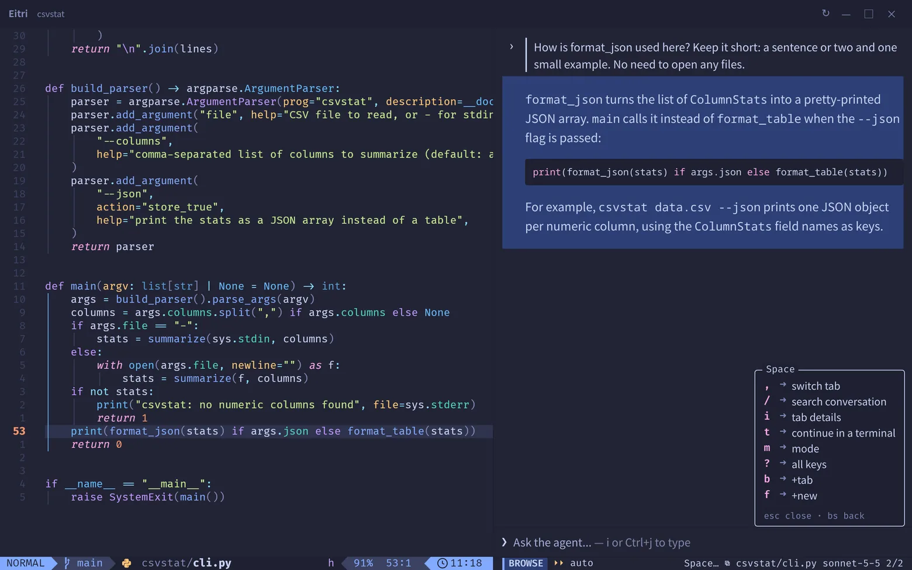

English | [简体中文](README.zh-CN.md)

<div align="center">


<h1>Eitri</h1>

<p><b>Your Neovim, with Claude Code beside it.</b></p>

<p>
<a href="https://eitri.cc">Website</a> ·
<a href="INSTALL.md">Install</a> ·
<a href="https://github.com/HunterGrey-cyber/eitri/discussions">Discussions</a> ·
<a href="https://matrix.to/#/#eitri:matrix.org">Matrix</a> ·
<a href="https://t.me/eitri_cc">Telegram</a>
</p>

[](https://github.com/HunterGrey-cyber/eitri/releases/latest)
[](https://aur.archlinux.org/packages/eitri-bin)
[](LICENSE)

</div>

A Neovim GUI for Linux. A Claude Code you'd actually want to read: rendered markdown and diffs,
permission cards, all without reaching for the mouse. Eitri is a desktop window (MIT) around your own
Neovim configuration and the `claude` you have installed.

**[eitri.cc](https://eitri.cc)** has the screenshots, the keys, how it compares, and the requirements and limits.



- **Your own Neovim.** A real `nvim --embed` with your `init.lua`, plugins, LSP and keymaps, drawn by a
  fork of Neovide's GPU renderer.
- **Replies you can read.** Markdown, code in your colorscheme's colours, foldable tool calls, and each
  edit as its own diff row.
- **Keyboard end to end.** vim keys in the panel, tmux keys for the window, `Ctrl+h/j/k/l` across panes.
- **Configured in Lua.** `~/.config/eitri/init.lua`, the way Neovim reads yours.

## Install

```sh
curl --proto '=https' --proto-redir '=https' --tlsv1.2 -sSfL https://github.com/HunterGrey-cyber/eitri/releases/latest/download/install.sh | sh
eitri ~/path/to/project
```

Linux x86_64 on Wayland, with Neovim 0.10 or newer and Claude Code installed. On Arch:
[`eitri-bin`](https://aur.archlinux.org/packages/eitri-bin) or [`eitri-git`](https://aur.archlinux.org/packages/eitri-git)
from the AUR. `.deb`, `.rpm`, building from source and verifying a download: [INSTALL.md](INSTALL.md).

0.2 is the first public release: expect rough edges, and the `init.lua` API and default keys may still
change in 0.x. Known limits are on [eitri.cc](https://eitri.cc/#requirements); what comes next is on the
[roadmap](https://eitri.cc/#roadmap).

## Community

- [Discussions](https://github.com/HunterGrey-cyber/eitri/discussions): questions, ideas, your setups
- [Matrix](https://matrix.to/#/#eitri:matrix.org) `#eitri:matrix.org` (English) and [Telegram](https://t.me/eitri_cc) (mostly Chinese)
- [Issues](https://github.com/HunterGrey-cyber/eitri/issues) for bugs; [CONTRIBUTING.md](CONTRIBUTING.md) for building and the tests
- The [Neovide fork](https://github.com/HunterGrey-cyber/neovide) (`neovibe-integration`) and the [agent sidecar](https://github.com/HunterGrey-cyber/verdandi) live in their own repositories

## Licence

MIT ([LICENSE](LICENSE)), except `terminal-input/`, which is Apache-2.0 (derived from Alacritty; see
its `NOTICE`). The editor pane is built on a fork of [Neovide](https://github.com/neovide/neovide) (MIT).

`shell` statically links [nvim-rs](https://crates.io/crates/nvim-rs) 0.9.2, which is **LGPL-3.0**:
each release page carries the Corresponding Source (`eitri-<version>-source.tar.gz`), and the
installed `SOURCE` file gives the recipe for relinking against a modified nvim-rs.
`THIRD-PARTY-LICENSES` carries every other notice.

The agent sidecar bundles Anthropic's Claude Agent SDK, which is not open source. No Eitri release
contains it: `eitri setup` downloads it from npm and builds the sidecar on your machine, under
Anthropic's own terms.

The logo's blue and green come from the [Neovim logo](https://neovim.io) by Jason Long (CC BY 3.0).

Eitri is developed with Claude's assistance.
