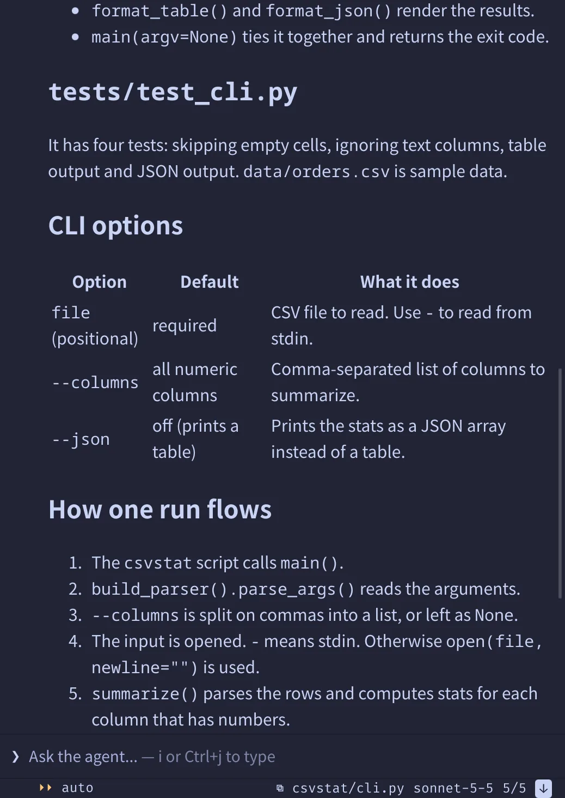
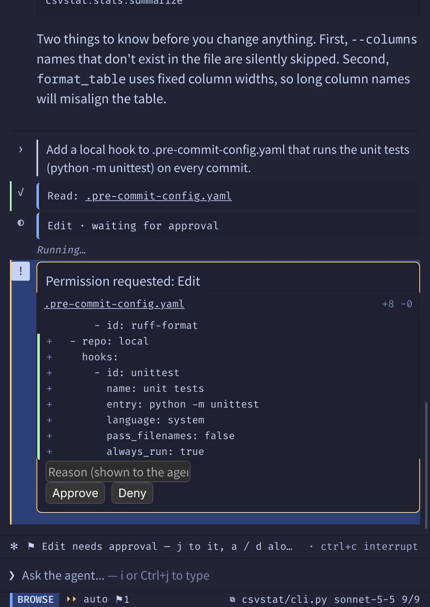
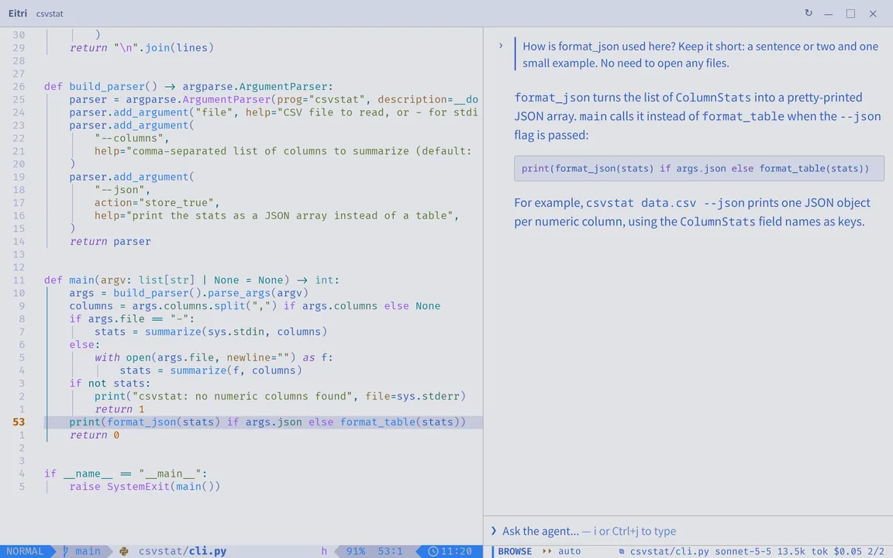
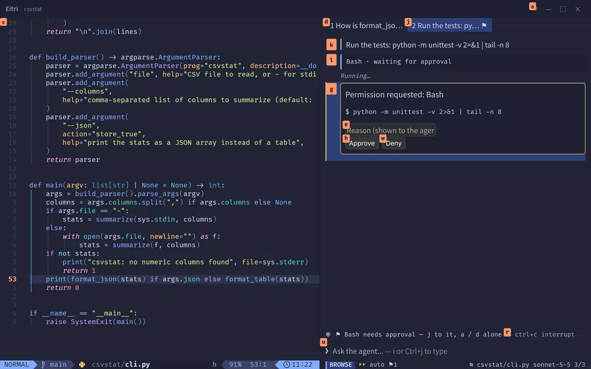

English | [简体中文](README.zh-CN.md)


# Eitri

**Your Neovim, with Claude Code beside it.**

A Claude Code you'd actually want to read: rendered markdown and diffs, permission cards, all without
reaching for the mouse. Eitri is a Linux desktop window (MIT) around your own Neovim configuration and
the `claude` you have installed.

Website: **[eitri.cc](https://eitri.cc)**


<sub>An Eitri 0.2.0 release candidate in a headless sway sandbox: the LazyVim starter, tokyonight-moon.</sub>

- **Your own Neovim.** A real `nvim --embed` with your `init.lua`, plugins, LSP and keymaps, drawn by a
  fork of Neovide's GPU renderer; Eitri keeps only a few keys for itself.
- **Replies you can read.** Markdown, code highlighted in your colorscheme's syntax colours, tool calls
  with foldable results, and each edit as its own diff row; after an edit, an open file you have not
  modified reloads in your Neovim. The current file's name and any Visual selection go with each prompt.
- **Keyboard first.** vim keys in the panel, tmux keys for the window (prefix `Ctrl+b`), and
  `Ctrl+h/j/k/l` across panes.
- **One window per project**: several agent sessions in tabs, a bottom terminal, and a layout that
  is kept per project.

```sh
curl --proto '=https' --proto-redir '=https' --tlsv1.2 -sSfL https://github.com/HunterGrey-cyber/eitri/releases/latest/download/install.sh | sh
eitri ~/path/to/project
```

Linux x86_64 only; read [Status and limits](#status-and-limits) first. A release candidate installs
with the command in its own notes on the [releases page](https://github.com/HunterGrey-cyber/eitri/releases).
The installer downloads the release from GitHub, checks its checksums, installs under `~/.local`
without `sudo` and builds the agent sidecar on your machine; `.deb`, `.rpm`, from-source and
verifying a final release are in [INSTALL.md](INSTALL.md).

## What it does

- **The editor.** Neovide's renderer on a `GtkGLArea`, driving an `nvim` started in the project
  directory. Kept for Eitri: `Ctrl+h/j/k/l`, `Ctrl+=`/`Ctrl+-`/`Ctrl+0` (text size) and `F11`.
- **The agent.** Claude Code, through the Claude Agent SDK, in a separate sidecar process. Replies
  stream in as they are written. The conversation is held in the Rust host, not the web view, so it
  survives a reload or a crash of the panel (a draft typed in the last 300 ms may not).
- **Approvals.** Every tool call passes a gate. In **auto** mode Eitri allows, without asking, edits
  inside the project and reads it can confirm stay inside it; nearly everything else is a card (no shell parser, so a
  pipe, a redirect or a `cd` asks), and a card can offer to always allow that kind of call here. In
  **bypass** mode nothing asks; entering it asks first.
- **Sessions.** One conversation per tab, all running at once. A remembered session can be resumed
  from the chooser, and `<leader>t` closes a conversation here and shows the `claude --resume`
  command that continues it in your terminal.
- **The window.** Editor, panel and terminal are modules you show, hide, split, swap and zoom with
  tmux's keys. The bottom terminal is its own PTY running your shell, with bracketed paste, OSC 52
  copy and a copy mode. One `:colorscheme` in Neovim recolours the chrome and the panel. Keys and
  options live in `~/.config/eitri/init.lua`; a colliding binding is a startup error naming both.

 



## Keys

Window keys follow stock tmux and panel keys follow vim. **`prefix ?` lists every key bound in your
build, with your own rebindings applied; it, not this table, is the reference.**

| Where | Keys |
|---|---|
| After the prefix (`Ctrl+b`) | `c` new agent tab, `n`/`p` next/previous tab, `w` choose a tab or session, `a`/`e`/`t` show and focus the agent, editor or terminal (hide it if it already has the keys), `z` zoom, `x` close the module after y/n, `f` jump labels, `?` all keys |
| Agent panel, browsing | `j`/`k` rows, `gg`/`G`, `/` search, `a`/`d` allow/deny the card under the cursor, `D` deny with a reason, `y` copy, `i` or `Ctrl+j` start typing |
| Agent panel, typing | `Enter` send, `Ctrl+y` approve the oldest waiting card, `Ctrl+g` edit the prompt in `nvim`, `Shift+Tab` auto ⇄ bypass, `Esc` or `Ctrl+k` back to browsing |

`Ctrl+h/j/k/l` move between panes: in Neovim's Normal and Visual mode after its own splits
(vim-tmux-navigator decides the edge if you use it), and always from the terminal, whose shell never
sees them (`prefix Ctrl+l` sends the literal). The panel's leader is your Neovim `mapleader`.
[`docs/keymap/tmux-ctrl-a.lua`](docs/keymap/tmux-ctrl-a.lua) ports one full tmux configuration.



## How it compares

Other ways to run a coding agent next to Neovim, as each project describes itself (read 2026-09-30):

| | Editor | Agent | Where you read the agent's work |
|---|---|---|---|
| Eitri | Neovim (`nvim --embed`, your config) | Claude Code | A rendered panel beside your own Neovim, in one window. |
| [avante.nvim](https://github.com/avante-corp/avante.nvim) | Neovim (plugin) | Many LLM providers; ACP agents, Claude Code among them | A sidebar chat in Neovim windows |
| [codecompanion.nvim](https://github.com/olimorris/codecompanion.nvim) | Neovim (plugin) | LLM adapters; ACP agents, Claude Code among them | A chat buffer; larger proposed edits in a floating diff |
| [claude-code.nvim](https://github.com/greggh/claude-code.nvim) | Neovim (plugin) | Claude Code | Claude Code's terminal UI in a Neovim window |
| [claudecode.nvim](https://github.com/coder/claudecode.nvim) | Neovim (plugin, Claude Code's IDE protocol) | Claude Code | Claude Code in a terminal split; proposed edits in a Neovim diff view |
| [CopilotChat.nvim](https://github.com/CopilotC-Nvim/CopilotChat.nvim) | Neovim (plugin) | Models through GitHub Copilot, plus custom providers | A chat window in Neovim |
| [Claude Code CLI](https://code.claude.com/docs/en/overview), in a tmux pane | Neovim in another pane | Claude Code | The CLI's own terminal UI |
| [Zed](https://zed.dev/docs/ai/overview) | Zed, with its Vim emulation layer | Zed's agent; ACP agents, Claude among them | Zed's agent panel, with per-hunk review |
| [Cursor](https://cursor.com/docs) | Cursor, based on VS Code | Cursor's agent, over models from several vendors | A side pane and an agents window |

## Why not a plugin

We work in the terminal ourselves, and we are not asking you to leave it. Eitri steps outside it for
one thing terminal cells cannot draw: the reply laid out as a document. The Neovim plugins above and a tmux
pane running `claude` keep you in the terminal, tmux and `ssh`; what Eitri adds is the reading. And if
Neovide on its own was not a reason to leave the terminal, Eitri's editor half is not one either: the
editor is the same Neovim, drawn the same way.

The reason is the other half: reading what the agent did. In a terminal or a Neovim buffer, a reply is
drawn into a grid of cells in one font. Eitri lays it out in a web view
(prose, tables, code blocks, diffs) and keeps everything around it Vim-shaped: the panel has modes,
counts, `gg`/`G`, search and your leader key; approving is `a` on a card; the window is driven by
tmux's keys. Zed and Cursor also render the agent's work, but around their own editor.

What it costs: a GUI window (Linux, x86_64, tested on Wayland; no remote editing), Claude Code as the
only agent, and more memory and GPU time than native Neovide, since the panel is a web view. Measured
in headless sway (Intel Core Ultra 5 125H, Mesa 26.2.2, GTK 4.22.5, WebKitGTK 2.52.6, 3072x1920 at
165 Hz, scale 1.5), both apps on `nvim --clean` with fresh profiles, native Neovide built from the same
fork, the panel on its empty tab with no agent running; not yet measured on GTK 4.14 or Ubuntu 24.04:

- **Memory.** 272 MiB (PSS, whole process tree) against 67-70 MiB; WebKit's two processes were about
  137 MiB of it. Each agent tab adds a sidecar (about 80 MiB RSS) and its own `claude` (265-290 MiB
  RSS), about 350 MiB per tab.
- **GPU** 3.2 ms per changed frame against about 1 ms; **startup** 672 ms to an editable buffer
  against 499 ms.

## Status and limits

Eitri 0.2.0 is in release candidates. Bugs, probably; the `init.lua` API and the default keys may
still change in 0.x.

<!-- TODO: after the rc.2 hardware test: the machines, GPUs, desktops and distributions it has been
used on, and what was exercised only in the project's headless GUI sandbox. -->

- **Platform.** Tested on Wayland (GNOME and sway); X11 is not refused but untested. No macOS or
  Windows build.
- **Ubuntu 23.10 and later.** The stock AppArmor policy blocks WebKitGTK's sandbox; the panel shows a
  one-time fix in its place instead ([INSTALL.md](INSTALL.md#ubuntu-2310-and-later)).
- **Input methods and scaling.** fcitx5 composition in all three panes, and a live change of output
  scale, have been tested in a headless sandbox only. A composition started right after a zoom or a
  resize can place its candidate window from a stale cursor position.
- **Typing latency** (key event to composited frame in a headless compositor, not input-to-photon;
  165 Hz; median added over native Neovide): +0.34 ms on AMD, +0.71-0.78 ms on Intel; +10.75 ms on AMD
  with `EITRI_EDITOR_DMABUF=0`. GTK older than 4.16 draws the editor another way, not yet measured.
- **Typing while a reply streams.** While you type in the editor, the panel's stream is throttled to
  5 updates/s (`agent.typing_cadence_hz`). Even so, 6-9 % of key presses took about two refreshes
  instead of one, measured on Intel with a stand-in stream; a real reply has not been measured.

## Requirements

- Linux on x86_64 with the `webkitgtk-6.0` API (WebKitGTK 2.40 or newer; required). The prebuilt
  binaries are built against glibc 2.39 and GTK 4.14; older glibc and GTK are untested. Ubuntu 24.04,
  Debian 13, Fedora 40+, RHEL 10 and Arch meet these. A Wayland session and a working OpenGL driver.
- Neovim ≥ 0.10 on `PATH`, or a private copy the installer fetches for Eitri alone (never on `PATH`).
- Claude Code ≥ 2.1.252 and < 3.0, installed. Eitri does not bundle Claude Code; it runs yours.
- For the agent sidecar, built on your machine at install time: network access (the installer fetches
  the Verdandi source and its own pinned Node.js; no system Node or npm is used) and about 600 MiB free.

## Roadmap

In this order, no dates.

1. An ACP client: agents other than Claude Code in the panel, Codex first.
2. `@` references to files, symbols and diagnostics, picked from Neovim.
3. Inline diffs: the agent's edit drawn in your Neovim buffer, taken or dropped hunk by hunk.
4. Every file a turn changed in one view, and a way to roll the turn back.
5. Start from your terminal: `:Eitri` in the Neovim you already run opens this window on the same
   session, and closing the window puts you back in the terminal where you left off. Or keep Neovim in
   your terminal for good and open only the agent panel as a window of its own, for Hyprland (or sway)
   to tile beside it: Neovim runs at your terminal's own speed, and `Ctrl+h/j/k/l` moves between the two.

## Telemetry

Eitri adds no telemetry of its own; Claude Code's own follows your Claude Code settings.

## Licence

MIT ([LICENSE](LICENSE)), except `terminal-input/`, which is Apache-2.0 (derived from Alacritty; see
its `NOTICE`). The editor pane is built on a fork of [Neovide](https://github.com/neovide/neovide) (MIT).

`shell` statically links [nvim-rs](https://crates.io/crates/nvim-rs) 0.9.2, which is **LGPL-3.0**:
each release page carries the Corresponding Source (`eitri-<version>-source.tar.gz`), and the
installed `SOURCE` file gives the recipe for relinking against a modified nvim-rs.
`THIRD-PARTY-LICENSES` carries every other notice.

The agent sidecar bundles Anthropic's Claude Agent SDK, which is not open source. No Eitri release
contains it: `eitri setup` downloads it from npm and builds the sidecar on your machine, under
Anthropic's own terms.

The logo's blue and green come from the [Neovim logo](https://neovim.io) by Jason Long (CC BY 3.0).

## Links

- [eitri.cc](https://eitri.cc): the homepage
- [Discussions](https://github.com/HunterGrey-cyber/eitri/discussions): questions, ideas, your setups
- [Releases](https://github.com/HunterGrey-cyber/eitri/releases), [issues](https://github.com/HunterGrey-cyber/eitri/issues)
- [INSTALL.md](INSTALL.md): every install route, verifying a download, updating, uninstalling
- [CONTRIBUTING.md](CONTRIBUTING.md): building from source and running the tests
- [HunterGrey-cyber/neovide](https://github.com/HunterGrey-cyber/neovide): the Neovide fork (`neovibe-integration`)
- [HunterGrey-cyber/verdandi](https://github.com/HunterGrey-cyber/verdandi): the agent sidecar

Eitri is developed with Claude's assistance.
